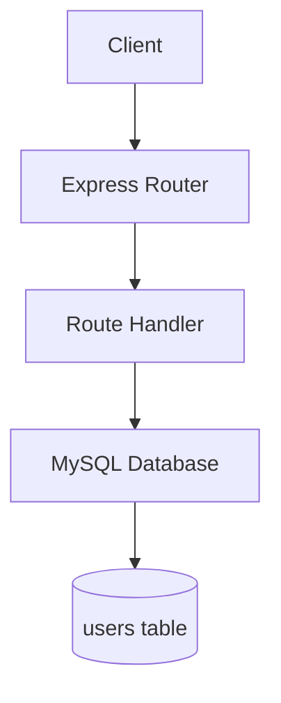

# 3.4 遗留代码改造

## 场景描述

你接手了一个"祖传代码"项目，没有文档、没有测试、代码混乱。用 Claude Code 可以快速**理解陌生代码**、**生成文档**、**添加测试**、**逐步重构**。

本章案例：改造一个 5 年前的 Express 项目（Express 3.x + 回调地狱 + 无测试）。

---

## 核心目标

- **理解代码**：让 Claude Code 生成代码文档（README、API 文档、架构图）
- **添加测试**：让 Claude Code 生成单元测试（覆盖核心功能）
- **逐步重构**：让 Claude Code 分步重构（先加测试，再重构）
- **生成文档**：让 Claude Code 生成 API 文档、部署文档

---

## 完整工作流

### 第一步：让 Claude Code 理解遗留代码（5分钟）

假设我们有一个遗留项目（`app.js`）：

```javascript
var express = require('express');
var app = express();
var mysql = require('mysql');

var db = mysql.createConnection({
  host: 'localhost',
  user: 'root',
  password: '',
  database: 'test'
});

db.connect();

app.post('/users', function(req, res) {
  var name = req.body.name;
  var email = req.body.email;
  
  if (!name || !email) {
    return res.status(400).send('Missing fields');
  }
  
  db.query('SELECT * FROM users WHERE email = ?', [email], function(err, results) {
    if (err) return res.status(500).send('DB error');
    
    if (results.length > 0) {
      return res.status(400).send('Email exists');
    }
    
    db.query('INSERT INTO users (name, email) VALUES (?, ?)', [name, email], function(err, result) {
      if (err) return res.status(500).send('DB error');
      
      db.query('SELECT * FROM users WHERE id = ?', [result.insertId], function(err, results) {
        if (err) return res.status(500).send('DB error');
        res.json(results[0]);
      });
    });
  });
});

app.listen(3000);
```

**问题清单**：
1. 使用 Express 3.x（已过时）
2. 回调地狱（嵌套 3 层）
3. 没有错误处理统一处理
4. 没有测试
5. 没有文档

---

### 第二步：让 Claude Code 生成文档（5分钟）

对 Claude Code 说：

```
请帮我理解这个遗留项目，并生成以下文档：
1. README.md（项目介绍、安装步骤、启动方式）
2. API 文档（所有接口的路径、参数、返回值）
3. 架构图（用 Mermaid 语法）
4. 代码注释（关键函数加上注释）

请逐文件分析，生成详细文档。
```

**Claude Code 会生成类似文档**：

#### 1. README.md

```markdown
# 用户管理系统

## 项目介绍

这是一个基于 Express 3.x 的用户管理系统，提供用户的 CRUD 接口。

## 技术栈

- Express 3.x
- MySQL
- Body-parser（需手动安装）

## 安装步骤

1. 安装依赖：
   ```bash
   npm install express@3 mysql
   ```

2. 配置数据库：
   - 创建数据库 `test`
   - 创建表 `users`（字段：id、name、email）

3. 启动项目：
   ```bash
   node app.js
   ```

## API 接口

### POST /users
创建用户

**参数**：
- `name`（必填）：用户名
- `email`（必填）：邮箱（唯一）

**返回**：
- 成功：201 + 用户对象
- 失败：400（参数错误、邮件已存在）

## 已知问题

1. 使用 Express 3.x（已过时，建议升级到 4.x）
2. 回调地狱（可读性差）
3. 没有错误处理统一处理
4. 没有测试

## 改进建议

1. 升级 Express 到 4.x
2. 用 async/await 解决回调地狱
3. 添加统一错误处理中间件
4. 添加单元测试
```

---

#### 2. API 文档（用 Swagger 格式）

```yaml
swagger: '2.0'
info:
  title: 用户管理系统 API
  version: 1.0.0
paths:
  /users:
    post:
      summary: 创建用户
      parameters:
        - name: body
          in: body
          required: true
          schema:
            type: object
            properties:
              name:
                type: string
              email:
                type: string
      responses:
        201:
          description: 创建成功
        400:
          description: 参数错误 / 邮件已存在
        500:
          description: 服务器错误
```

---

#### 3. 架构图（Mermaid）



---

#### 4. 代码注释（关键函数）

```javascript
/**
 * 创建用户
 * @param {Object} req - HTTP 请求
 * @param {Object} res - HTTP 响应
 * @returns {Object} 创建的用户对象
 */
app.post('/users', function(req, res) {
  // 获取请求参数
  var name = req.body.name;
  var email = req.body.email;
  
  // 参数校验
  if (!name || !email) {
    return res.status(400).send('Missing fields');
  }
  
  // 检查邮件是否已存在
  db.query('SELECT * FROM users WHERE email = ?', [email], function(err, results) {
    // ... 后续代码
  });
});
```

---

### 第三步：让 Claude Code 添加测试（8分钟）

```
请为遗留代码添加单元测试，要求：
1. 用 Jest + Supertest
2. 覆盖核心功能（创建用户、参数校验、邮件唯一性检查）
3. Mock 数据库（不依赖真实数据库）
4. 测试覆盖率 > 80%

请生成完整的测试代码。
```

**Claude Code 会生成测试代码**：

```javascript
// tests/app.test.js
const request = require('supertest');
const app = require('../app');
const db = require('../config/database');

// Mock 数据库
jest.mock('../config/database', () => ({
  query: jest.fn()
}));

describe('User API', () => {
  beforeEach(() => {
    jest.clearAllMocks();
  });
  
  // 测试创建用户
  describe('POST /users', () => {
    it('应该成功创建用户', async () => {
      // Mock 数据库返回（邮件不存在）
      db.query.mockImplementation((sql, params, callback) => {
        if (sql.includes('SELECT')) {
          callback(null, []);  // 邮件不存在
        } else if (sql.includes('INSERT')) {
          callback(null, { insertId: 1 });
        } else if (sql.includes('SELECT * FROM users WHERE id')) {
          callback(null, [{ id: 1, name: 'Alice', email: 'alice@example.com' }]);
        }
      });
      
      const response = await request(app)
        .post('/users')
        .send({ name: 'Alice', email: 'alice@example.com' });
      
      expect(response.status).toBe(200);
      expect(response.body.name).toBe('Alice');
    });
    
    it('应该返回 400 如果邮件已存在', async () => {
      // Mock 数据库返回（邮件已存在）
      db.query.mockImplementation((sql, params, callback) => {
        if (sql.includes('SELECT')) {
          callback(null, [{ id: 1, name: 'Alice', email: 'alice@example.com' }]);
        }
      });
      
      const response = await request(app)
        .post('/users')
        .send({ name: 'Alice', email: 'alice@example.com' });
      
      expect(response.status).toBe(400);
      expect(response.text).toBe('Email exists');
    });
  });
});
```

---

### 第四步：让 Claude Code 逐步重构（10分钟）

**原则**：先加测试，再重构（确保不引入 bug）。

#### 重构 1：升级 Express 3.x → 4.x

```
请帮我升级 Express 到 4.x，需要：
1. 安装 express@4 和 body-parser
2. 修改 app.js（Express 4.x 的 API 变化）
3. 确保测试通过

请生成完整代码。
```

Claude Code 会修改 `app.js`：

```javascript
var express = require('express');
var bodyParser = require('body-parser');  // ← Express 4.x 需要手动安装
var app = express();

// ← Express 4.x 需要用 body-parser 中间件
app.use(bodyParser.json());
app.use(bodyParser.urlencoded({ extended: true }));

// ... 后续代码不变
```

---

#### 重构 2：用 async/await 解决回调地狱

```
请帮我用 async/await 重构代码，需要：
1. 用 mysql2/promise 包装数据库查询
2. 把所有回调改造成 await
3. 用 try-catch 统一错误处理
4. 确保测试通过

代码：

[粘贴 app.js]
```

Claude Code 会生成重构后的代码：

```javascript
var express = require('express');
var bodyParser = require('body-parser');
var mysql = require('mysql2/promise');
var app = express();

app.use(bodyParser.json());

// 创建数据库连接池
var pool = mysql.createPool({
  host: 'localhost',
  user: 'root',
  password: '',
  database: 'test'
});

app.post('/users', async function(req, res) {
  try {
    var name = req.body.name;
    var email = req.body.email;
    
    if (!name || !email) {
      return res.status(400).send('Missing fields');
    }
    
    // 检查邮件是否已存在
    var [results] = await pool.query('SELECT * FROM users WHERE email = ?', [email]);
    
    if (results.length > 0) {
      return res.status(400).send('Email exists');
    }
    
    // 插入用户
    var [result] = await pool.query('INSERT INTO users (name, email) VALUES (?, ?)', [name, email]);
    
    // 查询新创建的用户
    var [users] = await pool.query('SELECT * FROM users WHERE id = ?', [result.insertId]);
    
    res.json(users[0]);
  } catch (error) {
    console.error(error);
    res.status(500).send('DB error');
  }
});

app.listen(3000);
```

---

#### 重构 3：添加统一错误处理

```
请帮我添加统一错误处理中间件，需要：
1. 创建 errorHandler 中间件
2. 所有路由的错误交给 errorHandler 处理
3. 返回统一的错误格式（JSON）

代码：

[粘贴 app.js]
```

Claude Code 会生成重构后的代码：

```javascript
var express = require('express');
var bodyParser = require('body-parser');
var mysql = require('mysql2/promise');
var app = express();

app.use(bodyParser.json());

var pool = mysql.createPool({
  host: 'localhost',
  user: 'root',
  password: '',
  database: 'test'
});

app.post('/users', async function(req, res, next) {
  try {
    var name = req.body.name;
    var email = req.body.email;
    
    if (!name || !email) {
      var err = new Error('Missing fields');
      err.status = 400;
      throw err;
    }
    
    var [results] = await pool.query('SELECT * FROM users WHERE email = ?', [email]);
    
    if (results.length > 0) {
      var err = new Error('Email exists');
      err.status = 400;
      throw err;
    }
    
    var [result] = await pool.query('INSERT INTO users (name, email) VALUES (?, ?)', [name, email]);
    var [users] = await pool.query('SELECT * FROM users WHERE id = ?', [result.insertId]);
    
    res.json(users[0]);
  } catch (error) {
    next(error);  // ← 交给错误处理中间件
  }
});

// 统一错误处理中间件
app.use(function(err, req, res, next) {
  console.error(err);
  var status = err.status || 500;
  res.status(status).json({
    error: err.message
  });
});

app.listen(3000);
```

---

### 第五步：验证重构结果（5分钟）

**运行测试**：

```bash
npm test
```

**检查测试覆盖率**：

```bash
npm test -- --coverage
```

**手动测试 API**：

```bash
# 创建用户
curl -X POST http://localhost:3000/users \
  -H "Content-Type: application/json" \
  -d '{"name": "Alice", "email": "alice@example.com"}'
```

---

## 核心技巧

### 1. 让 Claude Code 先生成文档，再重构

❌ **不好**：直接重构遗留代码（容易引入 bug）
✅ **好**：先生成文档 + 测试，再重构

```
第一步：生成 README、API 文档、架构图
第二步：添加单元测试（覆盖核心功能）
第三步：逐步重构（确保测试通过）
```

**原因**：有测试和文档，重构时更有信心。

---

### 2. 用"三步法"理解陌生代码

**第一步：让 Claude Code 生成 README**

```
请帮我生成 README.md，包含：
1. 项目介绍
2. 安装步骤
3. 启动方式
4. API 接口列表
```

**第二步：让 Claude Code 生成 API 文档**

```
请帮我生成 API 文档（用 Swagger 或 Markdown 格式），包含：
1. 所有接口的路径、参数、返回值
2. 错误码说明
```

**第三步：让 Claude Code 生成架构图**

```
请帮我用 Mermaid 语法生成架构图，包含：
1. 客户端 → 服务器 → 数据库
2. 数据流向
```

---

### 3. 遗留代码重构原则：先加测试，再重构

❌ **不好**：直接重构代码（没有测试，容易引入 bug）
✅ **好**：先加测试，再重构

**让 Claude Code 生成测试**：

```
请为遗留代码添加单元测试，要求：
1. Mock 所有外部依赖（数据库、第三方 API）
2. 覆盖核心功能
3. 测试覆盖率 > 80%
```

---

### 4. 用 Git 管理重构过程

每次重构一步就 commit 一次，方便回滚：

```bash
# 第一步：生成文档和测试
git add .
git commit -m "docs: 添加 README、API 文档、单元测试"

# 第二步：升级 Express 4.x
git add .
git commit -m "refactor: 升级 Express 3.x → 4.x"

# 第三步：用 async/await 解决回调地狱
git add .
git commit -m "refactor: 用 async/await 解决回调地狱"

# 第四步：添加统一错误处理
git add .
git commit -m "refactor: 添加统一错误处理中间件"
```

---

## 常见问题

### Q1：Claude Code 生成的测试代码有 bug 怎么办？

把错误信息发给它：

```
运行测试的时候报错了：

TypeError: Cannot read property 'mockImplementation' of undefined

这是我的测试代码：

[粘贴代码]

请帮我修复。
```

---

### Q2：如何理解一个完全没有文档的项目？

**分步让 Claude Code 生成文档**：

```
第一步：请帮我生成 README.md（项目介绍、安装步骤、启动方式）
第二步：请帮我生成 API 文档（所有接口的路径、参数、返回值）
第三步：请帮我用 Mermaid 生成架构图
第四步：请帮我生成数据库 ER 图
```

---

### Q3：重构后性能下降了怎么办？

让 Claude Code 帮你分析：

```
重构后性能下降了，请帮我检查：
1. 是否有不必要的数据库查询
2. 是否有循环嵌套
3. 是否可以加缓存（Redis）
```

---

## 实战练习

**任务**：找一个遗留项目（没有文档、没有测试），用 Claude Code 改造，要求：
1. 让 Claude Code 生成文档（README、API 文档、架构图）
2. 让 Claude Code 添加单元测试（覆盖率 > 80%）
3. 让 Claude Code 逐步重构（先加测试，再重构）
4. 用 Git 管理重构过程

**提示**：参考本案例的工作流，让 Claude Code 一步步完成。

---

## 小结

- **理解代码**：让 Claude Code 生成文档（README、API 文档、架构图）
- **添加测试**：让 Claude Code 生成单元测试（覆盖核心功能）
- **逐步重构**：先加测试，再重构（确保不引入 bug）
- **Git 管理**：每步重构都 commit，方便回滚
- **持续改进**：定期让 Claude Code 审查代码，保持高质量

---

## 第三章总结

本章我们学习了 4 个重构与优化案例：

1. **3.1 代码重构实战**：识别问题代码、分步重构、验证结果
2. **3.2 性能优化案例**：定位性能瓶颈、加索引、缓存、分页
3. **3.3 架构调整场景**：微服务拆分、服务间通信、数据一致性
4. **3.4 遗留代码改造**：理解陌生代码、生成文档、添加测试、逐步重构

**下一章**：我们将学习调试与排错（第四章），包括错误定位技巧、日志分析案例、测试用例生成、Bug 修复实战。
