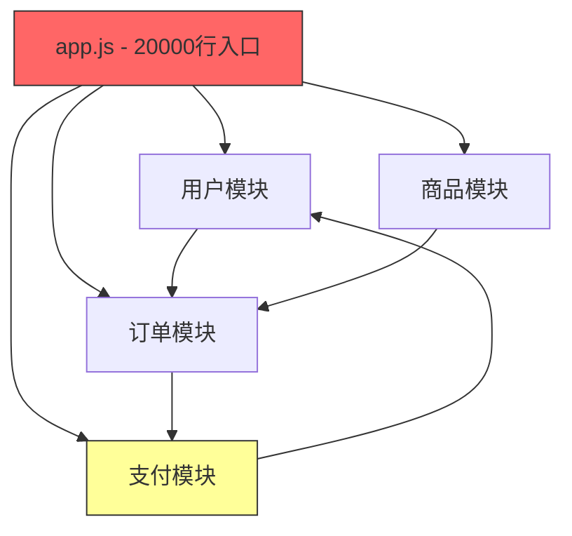

# 11.2 遗留代码重构实战（真实场景）

> **场景**：接手一个 5 年前的旧项目，代码耦合严重、没有测试、文档缺失。用 Claude Code 快速理解代码、制定重构策略、逐步改进。

---

## 场景描述

你刚入职一家创业公司，接手了一个"能跑但不要动"的遗留项目：

**项目背景**：
- 一个运行了 5 年的电商后台系统
- 原始开发者已离职，没有文档
- 代码 2 万行，全部在一个文件里
- 没有测试，没有类型标注
- 偶尔会出 Bug，但没人敢改

**你的任务**：
1. 理解现有代码
2. 制定重构计划
3. 逐步改进，而不引入新 Bug

**传统做法 vs Claude Code**：

| 步骤 | 传统做法 | 用 Claude Code | 时间对比 |
|------|----------|----------------|----------|
| 理解代码 | 逐行阅读 2 万行，2-3 天 | 分析架构+生成摘要，2-3 小时 | 节省 90% |
| 制定重构计划 | 凭经验猜测，1 天 | 自动识别坏味道+生成计划，30 分钟 | 节省 95% |
| 编写测试 | 手写测试，2-3 天 | 生成测试骨架+完善，3-4 小时 | 节省 85% |
| 执行重构 | 小心翼翼手动改，1-2 周 | 分步执行+自动回归，3-4 天 | 节省 70% |

---

## 第一步：用 Claude Code 理解遗留代码

### 1.1 让 Claude Code 读完整项目

打开项目目录，让 Claude Code 自己探索：

```bash
cd legacy-ecommerce
claude
```

```
> 请阅读这个项目的所有源代码，然后给我一份完整的架构分析报告，包括：
> 1. 项目结构和模块划分
> 2. 核心业务逻辑和数据流
> 3. 依赖关系图
> 4. 代码中的坏味道和潜在问题
> 5. 建议的重构优先级
```

Claude Code 会自动读取所有文件，生成一份详细的分析报告。这比你自己逐行阅读快 10 倍以上。

### 1.2 生成代码地图

```
> 用 Mermaid 语法画出这个项目的模块依赖关系图，标注出循环依赖
```

输出示例：



这个图会立刻暴露问题：`app.js` 是一个 2 万行的超级文件，所有模块都纠缠在一起。

### 1.3 关键代码摘要

针对超大文件，让 Claude Code 分段解读：

```
> app.js 文件太大，请按功能区块给我摘要：
> 1. 用户认证相关的函数有哪些？
> 2. 订单处理的核心逻辑是什么？
> 3. 支付回调的处理流程是怎样的？
> 4. 哪些函数之间存在隐式耦合？
```

这比读源码快得多，而且 Claude Code 会发现你自己容易忽略的隐式依赖。

---

## 第二步：制定重构计划

### 2.1 自动识别坏味道

```
> 分析 app.js 中的代码坏味道，按严重程度排序，并给出每个问题的重构建议：
```

Claude Code 可能输出：

| # | 坏味道 | 严重度 | 位置 | 建议 |
|---|--------|--------|------|------|
| 1 | 超长文件(20000行) | 🔴 严重 | app.js | 按业务领域拆分为独立模块 |
| 2 | 全局变量污染 | 🔴 严重 | app.js 顶部 50+ 全局变量 | 改用模块作用域 + 依赖注入 |
| 3 | 回调地狱 | 🟡 中等 | 订单模块 | 改用 async/await |
| 4 | 硬编码配置 | 🟡 中等 | 数据库连接、API 密钥 | 抽取到 .env 配置文件 |
| 5 | 重复代码 | 🟡 中等 | 用户/商品验证逻辑 | 抽取公共验证模块 |
| 6 | 无错误处理 | 🔴 严重 | 支付回调 | 添加 try-catch + 错误日志 |
| 7 | 无类型标注 | 🟢 轻微 | 全局 | 逐步添加 JSDoc 或迁移 TypeScript |

### 2.2 生成重构路线图

```
> 基于上面的分析，生成一个分阶段的重构计划，要求：
> 1. 每个阶段独立可交付
> 2. 先加测试再重构
> 3. 每步改动尽量小，降低引入 Bug 的风险
> 4. 给出每个阶段的预估时间
```

输出示例：

**阶段 0：准备（1 天）**
- 搭建开发环境 + 本地运行
- 初始化 Git 仓库（如果还没有）
- 创建 `.env.example`
- 安装 ESLint + Prettier

**阶段 1：补测试（2-3 天）**
- 用 Claude Code 为核心函数生成集成测试
- 优先覆盖：用户认证、订单创建、支付回调
- 目标：核心路径测试覆盖率 > 60%

**阶段 2：拆文件（2-3 天）**
- 从 app.js 拆出独立模块：`routes/`、`models/`、`services/`
- 每拆一个模块，跑一遍测试确保不破坏
- 逐步引入模块系统(require/import)

**阶段 3：消灭全局变量（1-2 天）**
- 全局变量 → 配置文件或依赖注入
- 数据库连接 → 单例模式 + 连接池

**阶段 4：异步改造（1-2 天）**
- 回调地狱 → async/await
- 错误处理 → 统一错误中间件

**阶段 5：类型化（2-3 天）**
- 添加 JSDoc 类型标注
- 可选：渐进迁移到 TypeScript

总计：**9-14 天**（传统做法需要 1-2 个月）

---

## 第三步：先补测试，再动手

> **铁律**：没有测试覆盖的代码，绝不重构。Claude Code 可以帮你快速补测试。

### 3.1 生成集成测试骨架

```
> 分析 app.js 中所有 HTTP 路由，为每个路由生成集成测试。使用 Jest + supertest。
> 要求：
> 1. 每个路由至少测试正常流程和主要错误场景
> 2. 使用内存数据库或 mock
> 3. 测试之间互不依赖
```

Claude Code 生成的测试示例：

```javascript
// tests/integration/order.test.js
const request = require('supertest');
const app = require('../../app');
const { mockDB, clearDB } = require('../helpers/db');

beforeEach(() => clearDB());
afterAll(() => mockDB.close());

describe('订单 API', () => {
  test('创建订单 - 正常流程', async () => {
    const user = await createTestUser();
    const product = await createTestProduct({ stock: 10 });

    const res = await request(app)
      .post('/api/orders')
      .set('Authorization', `Bearer ${user.token}`)
      .send({
        items: [{ productId: product.id, quantity: 2 }],
        address: '测试地址'
      });

    expect(res.status).toBe(201);
    expect(res.body.order).toBeDefined();
    expect(res.body.order.total).toBe(product.price * 2);
  });

  test('创建订单 - 库存不足', async () => {
    const user = await createTestUser();
    const product = await createTestProduct({ stock: 1 });

    const res = await request(app)
      .post('/api/orders')
      .set('Authorization', `Bearer ${user.token}`)
      .send({
        items: [{ productId: product.id, quantity: 5 }]
      });

    expect(res.status).toBe(400);
    expect(res.body.error).toMatch(/库存不足/);
  });

  test('创建订单 - 未登录', async () => {
    const res = await request(app)
      .post('/api/orders')
      .send({ items: [{ productId: 1, quantity: 1 }] });

    expect(res.status).toBe(401);
  });
});

describe('支付回调', () => {
  test('支付成功回调 - 更新订单状态', async () => {
    const order = await createTestOrder({ status: 'pending' });

    const res = await request(app)
      .post('/api/payment/callback')
      .send({
        orderId: order.id,
        status: 'success',
        transactionId: 'TXN_123456'
      });

    expect(res.status).toBe(200);
    const updated = await getOrder(order.id);
    expect(updated.status).toBe('paid');
  });

  test('支付回调 - 重复通知幂等处理', async () => {
    const order = await createTestOrder({ status: 'paid' });

    const res = await request(app)
      .post('/api/payment/callback')
      .send({
        orderId: order.id,
        status: 'success',
        transactionId: 'TXN_123456'
      });

    // 幂等：已支付的订单不应该出错
    expect(res.status).toBe(200);
  });
});
```

### 3.2 快速覆盖核心路径

```
> 帮我为核心业务函数生成单元测试。先列出 app.js 中所有导出的函数，然后逐一生成测试。
> 优先级：支付 > 订单 > 用户 > 商品
```

一次生成，几分钟就能获得几十个测试用例的骨架，然后你只需要微调。

---

## 第四步：拆文件 — 从巨石到模块

### 4.1 拆出路由模块

```
> 把 app.js 中所有路由定义提取到独立的 routes/ 目录下，按业务领域拆分：
> - routes/auth.js - 认证相关路由
> - routes/products.js - 商品路由
> - routes/orders.js - 订单路由
> - routes/payments.js - 支付路由
> - routes/admin.js - 管理后台路由
>
> 要求：
> 1. 使用 Express Router
> 2. 保持路由路径不变
> 3. 中间件按需挂载
> 4. 在 app.js 中用 app.use() 引入
```

Claude Code 生成的示例：

```javascript
// routes/orders.js
const Router = require('express').Router;
const { createOrder, getOrder, listOrders, cancelOrder } = require('../services/orderService');
const { authMiddleware } = require('../middleware/auth');

const router = Router();

router.post('/', authMiddleware, async (req, res, next) => {
  try {
    const order = await createOrder(req.user.id, req.body);
    res.status(201).json({ order });
  } catch (err) {
    next(err);
  }
});

router.get('/:id', authMiddleware, async (req, res, next) => {
  try {
    const order = await getOrder(req.params.id, req.user.id);
    res.json({ order });
  } catch (err) {
    next(err);
  }
});

router.get('/', authMiddleware, async (req, res, next) => {
  try {
    const orders = await listOrders(req.user.id, req.query);
    res.json({ orders });
  } catch (err) {
    next(err);
  }
});

router.delete('/:id', authMiddleware, async (req, res, next) => {
  try {
    await cancelOrder(req.params.id, req.user.id);
    res.json({ message: '订单已取消' });
  } catch (err) {
    next(err);
  }
});

module.exports = router;
```

```javascript
// app.js（重构后）
const express = require('express');
const app = express();

// 中间件
app.use(express.json());
app.use(require('./middleware/requestLogger'));

// 路由
app.use('/api/auth', require('./routes/auth'));
app.use('/api/products', require('./routes/products'));
app.use('/api/orders', require('./routes/orders'));
app.use('/api/payments', require('./routes/payments'));
app.use('/api/admin', require('./routes/admin'));

// 错误处理
app.use(require('./middleware/errorHandler'));

module.exports = app;
```

**关键**：每拆一个模块，立刻跑测试：

```bash
npm test
```

如果测试全绿，提交：

```bash
git add -A && git commit -m "refactor: 拆分路由到独立模块"
```

### 4.2 拆出服务层

路由拆完后，继续拆业务逻辑：

```
> 把路由中的业务逻辑提取到 services/ 目录，让路由只负责：
> 1. 参数校验
> 2. 调用 service
> 3. 返回响应
>
> 业务逻辑全部移到对应的 service 中。
> 路由 → service → model，严格分层。
```

这样每层职责清晰，后续维护和测试都更容易。

---

## 第五步：消灭全局变量

### 5.1 识别全局变量

```
> 列出 app.js 中所有全局变量的使用位置，分析每个全局变量的：
> 1. 读写位置
> 2. 生命周期
> 3. 建议的替代方案
```

### 5.2 配置外移

```bash
# 让 Claude Code 生成 .env 文件
```

```
> 找出代码中所有硬编码的配置项（数据库连接串、API密钥、端口号等），
> 生成 .env.example 文件，并在代码中用 process.env 替换硬编码值。
```

生成的 `.env.example`：

```env
# 数据库
DB_HOST=localhost
DB_PORT=5432
DB_NAME=ecommerce
DB_USER=postgres
DB_PASSWORD=your_password_here

# 服务
PORT=3000
NODE_ENV=development

# 第三方
PAYMENT_API_KEY=your_payment_key
PAYMENT_CALLBACK_URL=http://localhost:3000/api/payment/callback
JWT_SECRET=your_jwt_secret
```

### 5.3 数据库连接改为单例

```javascript
// services/database.js
let pool = null;

function getPool() {
  if (!pool) {
    pool = require('pg').Pool({
      host: process.env.DB_HOST,
      port: process.env.DB_PORT,
      database: process.env.DB_NAME,
      user: process.env.DB_USER,
      password: process.env.DB_PASSWORD,
      max: 20,
      idleTimeoutMillis: 30000,
    });
  }
  return pool;
}

module.exports = { getPool };
```

每个 service 通过依赖注入获取：

```javascript
// services/orderService.js
const { getPool } = require('./database');

async function createOrder(userId, items) {
  const db = getPool();
  // ...
}
```

---

## 第六步：回调地狱 → async/await

### 6.1 批量转换

```
> 找出 app.js 中所有使用回调的异步代码，改写为 async/await。
> 注意：
> 1. 保持错误处理语义
> 2. 回调中的 err 参数 → try/catch
> 3. 嵌套回调 → 顺序执行的 await
> 4. 先确保测试通过再提交
```

**改造前**（回调地狱）：

```javascript
function processOrder(orderId, callback) {
  db.query('SELECT * FROM orders WHERE id = $1', [orderId], (err, order) => {
    if (err) return callback(err);
    db.query('SELECT * FROM products WHERE id = $1', [order.product_id], (err, product) => {
      if (err) return callback(err);
      paymentService.charge(order.total, (err, payment) => {
        if (err) return callback(err);
        db.query('UPDATE orders SET status = $1 WHERE id = $2', ['paid', orderId], (err) => {
          if (err) return callback(err);
          notificationService.send(order.user_email, (err) => {
            if (err) console.error('通知失败:', err); // 非关键，不阻塞
            callback(null, { order, payment });
          });
        });
      });
    });
  });
}
```

**改造后**（async/await）：

```javascript
async function processOrder(orderId) {
  const order = await db.query('SELECT * FROM orders WHERE id = $1', [orderId]);
  const product = await db.query('SELECT * FROM products WHERE id = $1', [order.product_id]);

  const payment = await paymentService.charge(order.total);

  await db.query('UPDATE orders SET status = $1 WHERE id = $2', ['paid', orderId]);

  // 非关键操作，不阻塞主流程
  notificationService.send(order.user_email).catch(err => {
    console.error('通知失败:', err);
  });

  return { order, payment };
}
```

代码从 18 行缩到 10 行，可读性提升 10 倍。

---

## 第七步：渐进式类型化

### 7.1 先加 JSDoc

```
> 为 services/ 目录下所有函数添加 JSDoc 类型标注。
> 包括：参数类型、返回值类型、可能抛出的错误。
> 如果有复杂的业务对象，用 @typedef 定义。
```

生成示例：

```javascript
/**
 * @typedef {Object} OrderItem
 * @property {number} productId - 商品ID
 * @property {number} quantity - 购买数量
 */

/**
 * @typedef {Object} Order
 * @property {number} id - 订单ID
 * @property {number} userId - 用户ID
 * @property {OrderItem[]} items - 订单商品列表
 * @property {number} total - 订单总额
 * @property {'pending'|'paid'|'shipped'|'completed'|'cancelled'} status - 订单状态
 */

/**
 * 创建新订单
 * @param {number} userId - 用户ID
 * @param {{ items: OrderItem[], address: string }} data - 订单数据
 * @returns {Promise<Order>} 创建的订单
 * @throws {Error} 库存不足时抛出错误
 */
async function createOrder(userId, data) {
  // ...
}
```

### 7.2 可选：迁移到 TypeScript

如果团队决定上 TypeScript，Claude Code 可以帮忙逐步迁移：

```
> 把 services/orderService.js 迁移为 TypeScript。
> 要求：
> 1. 定义所有必要的 interface 和 type
> 2. 导出类型供其他模块使用
> 3. 使用严格模式
> 4. 保持与现有 JavaScript 模块的兼容性
```

---

## 第八步：添加错误处理和日志

### 8.1 统一错误中间件

```
> 创建一个统一的 Express 错误处理中间件，要求：
> 1. 区分业务错误（4xx）和系统错误（5xx）
> 2. 生产环境不暴露堆栈
> 3. 所有错误记录到日志
> 4. 返回统一的错误响应格式
```

```javascript
// middleware/errorHandler.js
const logger = require('../utils/logger');

class AppError extends Error {
  constructor(message, statusCode) {
    super(message);
    this.statusCode = statusCode;
    this.isOperational = true;
  }
}

function errorHandler(err, req, res, _next) {
  // 如果不是预期的业务错误，按 500 处理
  const statusCode = err.isOperational ? err.statusCode : 500;
  const message = err.isOperational ? err.message : '服务器内部错误';

  // 记录日志
  if (statusCode >= 500) {
    logger.error({
      message: err.message,
      stack: err.stack,
      path: req.path,
      method: req.method,
      body: req.body,
    });
  } else {
    logger.warn({ message, path: req.path, method: req.method });
  }

  res.status(statusCode).json({
    error: message,
    ...(process.env.NODE_ENV === 'development' && { stack: err.stack }),
  });
}

module.exports = { errorHandler, AppError };
```

### 8.2 结构化日志

```
> 把项目中的 console.log 替换为结构化日志，使用 winston。
> 不同的日志级别对应不同的颜色和输出目标。
```

---

## 完整重构 Checklist

用这个清单跟踪重构进度，每次用 Claude Code 完成一步就打个勾：

```markdown
## 重构进度

### 阶段 0：准备
- [ ] 本地环境能跑起来
- [ ] 初始化 Git
- [ ] 安装 ESLint + Prettier
- [ ] 创建 .env.example

### 阶段 1：补测试
- [ ] 认证路由测试
- [ ] 订单路由测试
- [ ] 支付回调测试
- [ ] 商品路由测试
- [ ] 管理后台测试
- [ ] 核心路径覆盖率 > 60%

### 阶段 2：拆文件
- [ ] 拆分路由模块
- [ ] 拆分服务层
- [ ] 拆分数据访问层
- [ ] app.js 只保留启动逻辑

### 阶段 3：消灭全局变量
- [ ] 配置外移到 .env
- [ ] 数据库连接单例化
- [ ] 共享状态改为依赖注入

### 阶段 4：异步改造
- [ ] 回调 → async/await
- [ ] 添加错误处理

### 阶段 5：类型化
- [ ] 添加 JSDoc 类型标注
- [ ] （可选）迁移 TypeScript

### 阶段 6：基础设施
- [ ] 统一错误处理
- [ ] 结构化日志
- [ ] 健康检查端点
```

---

## 关键经验总结

### 用 Claude Code 重构遗留代码的 5 条原则

1. **先理解，再动手** — 让 Claude Code 先做完整分析，不要上来就改代码
2. **先测试，再重构** — 没有测试保护的重构就是赌博
3. **小步前进** — 每次只改一件事，改完跑测试，绿了再提交
4. **保持可部署** — 每一步重构后，项目都应该能正常运行
5. **让 Claude Code 做苦力** — 分析、生成测试、提取模块这些机械工作交给它，你来把控方向

### 常见陷阱

| 陷阱 | 正确做法 |
|------|----------|
| 一次性大重构 | 分阶段，每阶段独立可交付 |
| 不跑测试就提交 | 每次改动后 `npm test`，绿了再 commit |
| 追求完美架构 | 先跑起来，再逐步优化 |
| 重构时加新功能 | 重构归重构，新功能另开分支 |
| 一个人闷头干 | 让 Claude Code 做初稿，你做审查 |

---

> **小结**：遗留代码重构最怕的不是代码烂，而是不敢动。Claude Code 的价值在于：它帮你快速理解代码、生成测试保护网、自动化机械性重构工作。你只需要把控方向和审查结果，效率提升 3-5 倍不是梦。
